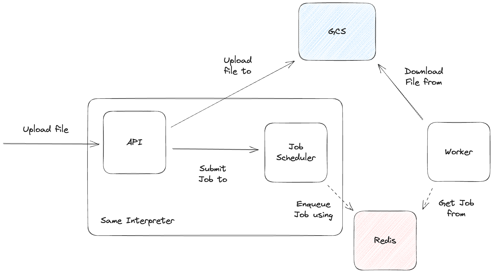

# Idea: Uploading received files to S3

This repo contains a very basic implementation of an API that allows users to upload files for processing.

To avoid doing CPU-bound processing in the asynchronous API server & separate responsibilities the API streams the uploaded file directly to block storage (GCS in our case) and delegates the processing by submitting a job to an executor. To minimize memory footprint the received file chunks are streamed to S3 as they are received.


## Disclaimer
This is nowhere near to production code, nor in functionality nor code quality. It is a small proof of concept to demonstrate how the system would look like, and we've favoured speed of implementation over everything else. Global state is still a bad idea for most "real" code.

## System description & implementation
The system consists on an API with a single enpoint `/upload` that receives `multipart/form-data` requests with the file content inside the `file` section and a very simple job executor that allows submitting jobs to count the size of the uploaded file. Files received by the API are uploaded to GCS & a job is submitted to the executor, which forwards it to an available workers and it takes care of downloading the file in chunks and printing it's total size.



The following technologies are used, mostly for ease of usage:
 * [FastAPI](https://fastapi.tiangolo.com/): Webserver
 * [ARQ](https://arq-docs.helpmanual.io/): Asynchronous job queue
 * [streaming-form-data](https://github.com/siddhantgoel/streaming-form-data): Parser for `multipart/form-data` streams. Comes with a built-in GCS/S3 sink.
 * [aiohttp](https://docs.aiohttp.org/en/stable/): Asynchronous http client

## Requirements
The system requires the following to work:
 * A Redis instance running in `localhost` and listening on port `6379` (default).
 * A GCP service account with the roles `roles/iam.serviceAccountTokenCreator` & `Storage viewer` on the desired bucket granted to it.
 * GCP [Application default credentials](https://cloud.google.com/docs/authentication/application-default-credentials) configured in the machine, with the roles `roles/iam.serviceAccountTokenCreator` & write permissions on the target bucket granted.
 * The following environment variables need to be set:
   - `FILE_UPLOAD_STAGING_BUCKET`: Name of the bucket to which the service account has been granted read permissions to.
   - `FILE_UPLOAD_SERVICE_ACCOUNT_EMAIL`: email of the service account with `roles/iam.serviceAccountTokenCreator` & `Storage viewer`.

## Installation
Create a virtualenv, activate it and from the root of the repo run the following to install all necessary dependencies

```
$ make install-dev
```

## Trying it out
From the virtualenv, run the following to start the API:

```
$ make start-api
```

In a different terminal, start one or more workers:

```
$ make start-worker
```

Then using your favourite client, send a `POST` `multipart/form-data` request to `localhost:8000/upload` with the file you want to upload in the `file` field of the body. For example, with curl:

```
$ curl -F file=@some_data.ndjson localhost:8000/upload
```

This will upload an hypothetic `some_data.ndjson` file to the API and when the whole process completes on the worker's terminal you'll be able to see the size of your file:

```
...
File size: 1024.00 MiB
...
```
